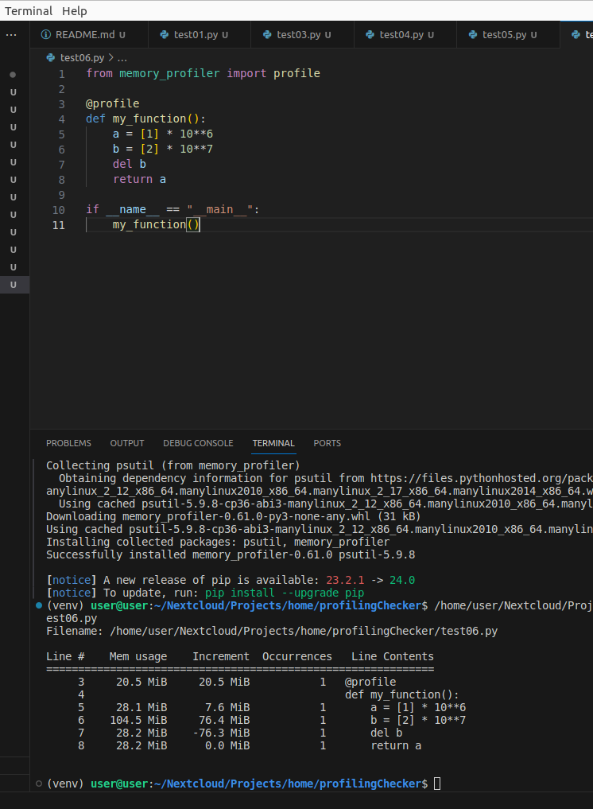

# 5. Профилирование памяти

## 5.1 Измерение использования памяти

Измерение использования памяти является ключевым шагом при профилировании, поскольку это позволяет определить, какие структуры данных и операции занимают больше всего памяти в процессе выполнения программы. В Python существует несколько инструментов для точного измерения расхода памяти, таких как `memory_profiler`, `tracemalloc` и встроенный модуль `gc`.

*Пример использования `memory_profiler`:*
```python
from memory_profiler import profile

@profile
def my_function():
    a = [1] * 10**6
    b = [2] * 10**7
    del b
    return a

if __name__ == "__main__":
    my_function()
```


## 5.2 Поиск утечек

Профилирование помогает выявить и устранить утечки памяти путем отслеживания объектов, которые не были корректно освобождены. Инструменты, такие как `objgraph` или встроенные средства Python, могут помочь в этом процессе.

## 5.3 Оптимизация коллекций

Профилирование помогает оптимизировать работу с различными типами коллекций в Python, такими как списки, кортежи, множества и словари. Путем анализа профилей выполнения можно выявить узкие места и оптимизировать использование коллекций.

## 5.4 Пример оптимизации списков

*Пример оптимизации работы со списками:*
```python
# Без оптимизации
def process_data(data):
    result = []
    for item in data:
        result.append(item * 2)
    return result

# С оптимизацией
def process_data_optimized(data):
    return [item * 2 for item in data]
```

## 5.5 Пример оптимизации словарей

*Пример оптимизации работы со словарями:*
```python
# Без оптимизации
def process_dict(data):
    result = {}
    for key, value in data.items():
        result[key] = value * 2
    return result

# С оптимизацией
def process_dict_optimized(data):
    return {key: value * 2 for key, value in data.items()}
```

## 5.6 Избегание копирования объектов

Избегание ненужного копирования объектов помогает сэкономить память и ускоряет выполнение программы. Профилирование может выявить места, где копирование неэффективно.

## 5.7 Использование буферов

Профилирование и оптимизация использования буферов для работы с данными в Python могут значительно улучшить производительность. Буферы позволяют избежать избыточных копирований данных.

## 5.8 Очистка неиспользуемых объектов

Очистка неиспользуемых объектов становится возможной благодаря профилированию. Выявление объектов, которые больше не нужны, и их удаление помогает освободить память.

## 5.9 Пример GC

*Пример использования сборщика мусора (GC):*
```python
import gc

def my_function():
    # some code
    gc.collect()  # явный вызов сборщика мусора
```

## 5.10 Пример weakref

*Пример использования `weakref` для оптимизации работы с объектами:*
```python
import weakref

class MyObject:
    pass

obj = MyObject()
ref = weakref.ref(obj)  # создание слабой ссылки
obj = None  # удаление оригинального объекта
result = ref()  # получение объекта через слабую ссылку
```